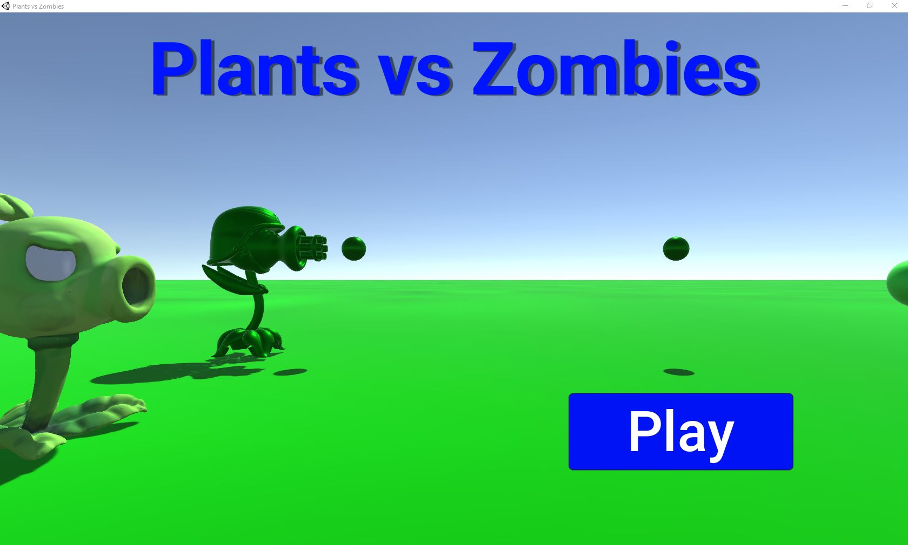
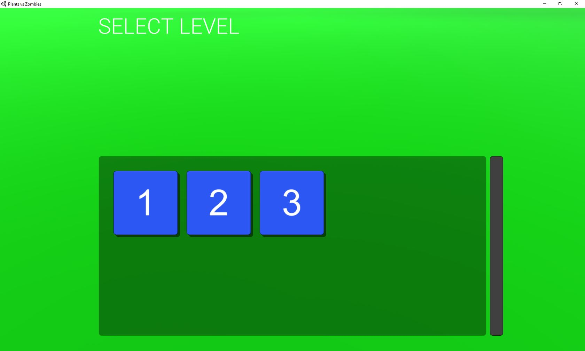
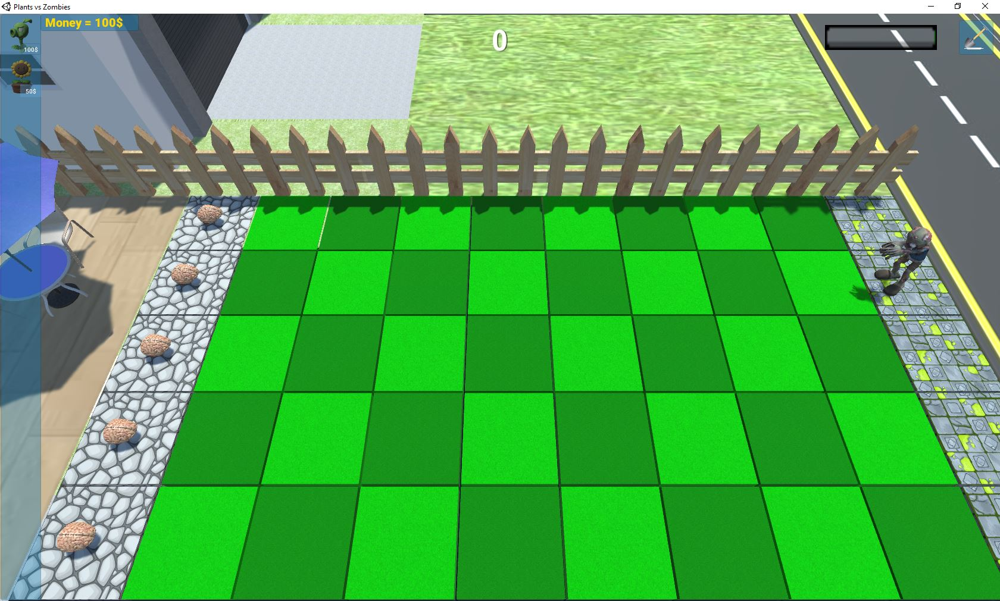
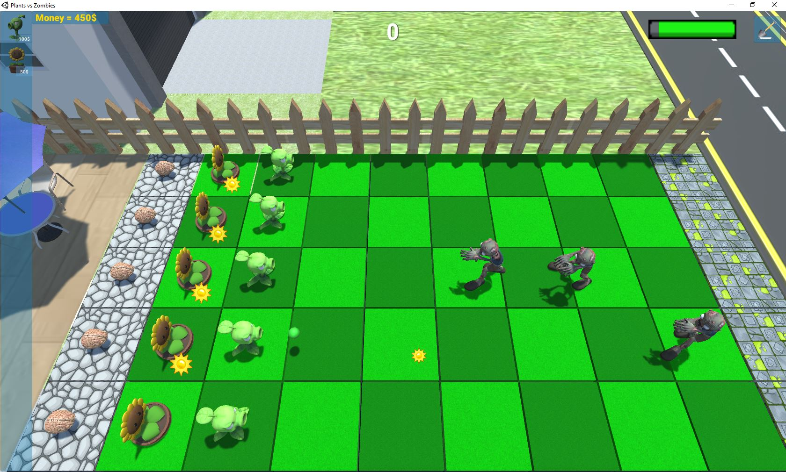

# Plants-vs-Zombies
A simple Plants vs zombies game clone made in unity with C#
You can see the demo video on [youtube](https://www.youtube.com/watch?v=vn2zIqOBnsc)

## Screenshots

    
    
    
    

## 3d models copyrights
- [Modern house](https://sketchfab.com/3d-models/modern-house-06-3eeb7a404c58491dbf3193d059599fed)
- [Wooden Fence](https://free3d.com/3d-model/simple-fence-68101.html)
- [Patio Set](https://sketchfab.com/3d-models/patio-set-37c3f6ee451f495ba183427a38a804b4)
- [Gatling Pea](https://www.thingiverse.com/thing:2819872/files)
- [Sunflower in a Pot](https://sketchfab.com/3d-models/pvz-sunflower-in-a-pot-3e38e8351c6e48e786cdd8bd181a09db)
- [Pea Shooter](https://sketchfab.com/3d-models/pvz-pea-shooter-36c813f7a6ff4b67a163d53b59eab4e4)
- [Snow Pea](https://sketchfab.com/3d-models/snow-pea-plants-vs-zombies-5eb5f7b490e84c4ea0684816b261d4af)
- [Brain](https://sketchfab.com/3d-models/brain-areas-d64608a3978b47d8a39c5a15795ca8c4)
